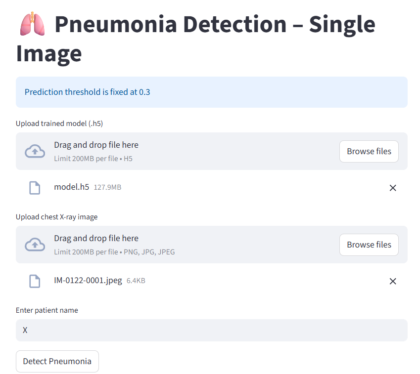
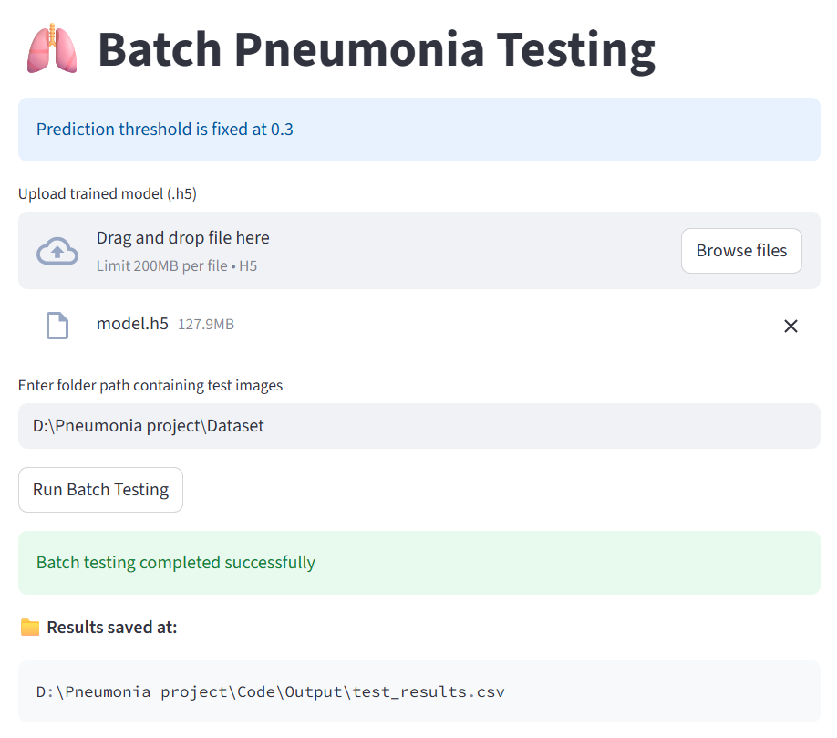

# 🩺 AI-Powered Diagnosis of Pneumonia Using Deep Learning

An AI-powered Deep Learning project that detects **Pneumonia from Chest X-ray Images** using **Convolutional Neural Networks (CNNs)**.
This system helps in the early identification of pneumonia using Artificial Intelligence and Medical Image Processing techniques.

---

# 📌 Project Overview

This project uses Deep Learning techniques to analyze chest X-ray images and classify whether a patient is affected by:

* Pneumonia
* Normal

The application supports:

✅ Single Image Prediction
✅ Multiple Image Prediction
✅ AI-powered Medical Image Analysis

The project is designed to assist in early-stage pneumonia detection and improve healthcare support systems using Artificial Intelligence.

---

# 🚀 Features

* Pneumonia detection using Deep Learning
* Chest X-ray image classification
* Single image prediction system
* Multiple image prediction system
* CNN-based medical image analysis
* Fast and accurate prediction
* User-friendly interface
* Organized project structure
* Screenshot-based result visualization

---

# 🛠️ Technologies Used

* Python
* TensorFlow
* Keras
* NumPy
* OpenCV
* Streamlit
* HTML
* CSS

---

# 📂 Project Structure

```bash
AI-Powered-Diagnosis-of-Pneumonia-Using-Deep-Learning/
│
├── code/
│   ├── single_img_app.py
│   ├── multiple_img_app.py
│   └── output/
│
├── dataset/                     # Ignored from GitHub
│   └── Chest_Xray_Images/
│
├── model/
│   └── model.h5                # Ignored from GitHub
│
├── screenshots/
│   ├── single_prediction.png
│   └── multiple_prediction.png
│
├── .gitignore
├── requirements.txt
└── README.md
```

---

# 📸 Application Screenshots

## 🔹 Single Image Prediction



---

## 🔹 Multiple Image Prediction



---

# 📈 Model Accuracy

| Metric              | Accuracy |
| ------------------- | -------- |
| Training Accuracy   | 96.31%   |
| Validation Accuracy | 96.90%   |

---

# 📚 Dataset Information

The dataset used for training contains chest X-ray images categorized into:

* Pneumonia
* Normal

This dataset is used for educational and research purposes in the field of:

* Medical Image Classification
* Artificial Intelligence
* Deep Learning

---

# ⚙️ Installation & Setup

## 1️⃣ Clone the Repository

```bash
git clone https://github.com/your-username/AI-Powered-Diagnosis-of-Pneumonia-Using-Deep-Learning.git
```

---

## 2️⃣ Move into the Project Folder

```bash
cd AI-Powered-Diagnosis-of-Pneumonia-Using-Deep-Learning
```

---

## 3️⃣ Install Required Libraries

```bash
pip install -r requirements.txt
```

---

## 4️⃣ Run Single Image Prediction

```bash
python code/single_img_app.py
```

---

## 5️⃣ Run Multiple Image Prediction

```bash
python code/multiple_img_app.py
```

---

# 🧠 Model Information

The CNN model is trained using chest X-ray datasets for binary image classification:

* Pneumonia
* Normal

The trained model is stored in `.h5` format inside the `model/` folder.

> Note: The trained `.h5` model file and dataset are ignored from GitHub because of large file size limitations.

---

# 📄 .gitignore Configuration

```bash
dataset/
model/*.h5
__pycache__/
venv/
```

---

# 📊 Future Improvements

* Improve model accuracy
* Add real-time webcam prediction
* Deploy using cloud platforms
* Create responsive web interface
* Add patient report generation system
* Add advanced medical visualization
* Add live online prediction support

---

# 👨‍💻 Author

## Kishoremala1234

---

# ⭐ Support

If you like this project:

⭐ Star the repository on GitHub
🍴 Fork the repository
📢 Share it with others

---

# 📬 Contact

For suggestions, improvements, or collaboration opportunities, feel free to connect through GitHub.
